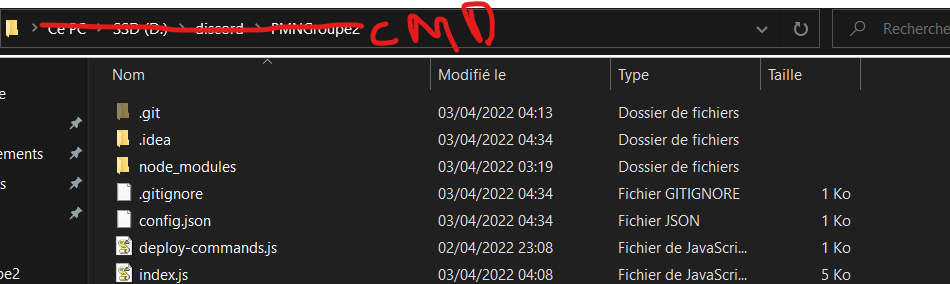

# ScrumAcolyte

- What is ScrumAcolyte are you asking?
ScrumAcolyte is discord bot to help your team collaborate easily, help with check-ins, motivations, dailyScrum preparation etc...
- Still in development but... hey ! Stay tuned, the bot is growing fast!


# Requirements:

- Pour que le bot fonctionne, il est nécessaire de remplir ```config.json```, j'ai glissé un template dans le repo (dossier).
- Le bot est en javascript, il nécessite donc NodeJS afin de fonctionner.
- We used NPM, CRON & MYSQL package to make the bot, dont forget to install these packages or the bot wont work at all.

# To setup the project :

- Ouvrir le dossier contenant le code du bot, vous devez ouvrir un invité de commande (petit tips pour le faire simplement ^-^ !) : 
- Dans le cmd, executer la commande : ```npm install discord.js``` et quand l'installation est terminée, vous pouvez commencer vos affaires :).

# To initialize the bot and its command

- Executer dans l'invité de commande : ```node deploy_commands.js``` pour initialisé le bot et ses commandes
- Une fois terminée, executer : ```node index.js``` et votre bot sera connecté :)!

